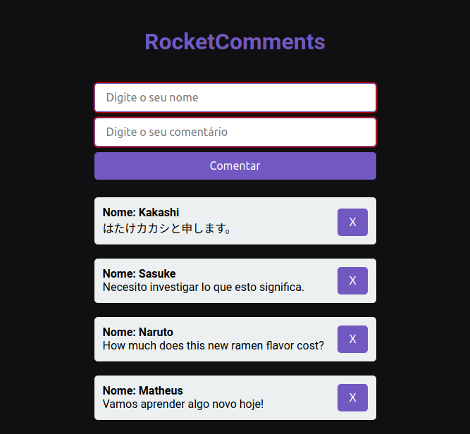

## GoStack Bootcamp Live 23

> 🚀 Practical project of the [Rocketseat](https://rocketseat.com.br) GoStack Bootcamp.  
👷 Developed by Matheus Ramalho de Oliveira.  
🔨 Systems Analyst, Full-Stack Developer.  
🏡 Goiânia, Goiás, Brasil.  
✉️ kastorcode@gmail.com  
👍 [instagram.com/kastorcode](https://www.instagram.com/kastorcode)

---

  

    Live 23: GraphQL

---

### Screenshot

  

---

### 🚀 Backend installation and execution

1. Make a clone of this repository;
2. Enter the folder running `cd gostack-live-23-graphql/server`;
3. Run `yarn` to install dependencies;
4. Rename the `.env.example` file to `.env`;
5. Put your credentials within `.env`;
6. Make sure you have a [Docker container](https://www.docker.com/resources/what-container) running with a [MongoDB image](https://hub.docker.com/_/mongo);
7. Run `yarn dev` to start the development server;
8. Open the address `http://localhost:4000` in browser to view the GraphQL Playground.

### 🚀 Frontend installation and execution

1. Open the terminal in the `gostack-live-23-graphql/client` folder;
2. Run `yarn` to install dependencies;
3. Run `yarn start` to start the development server;
4. Open the address `http://localhost:3000` in the browser.

---

### 🗓 ️Roadmap

- Introduction to Node.js
- Creating Node.js project
- Continuing Node.js project
- CSS Flexbox
- UI Design
- Introduction to React
- First project with ReactJS
- First project with React Native
- Front-end documentation
- Flux architecture
- Using React Hooks
- Server-side rendering(SSR) with ReactJS
- GraphQL
- Expo
- Creating ReactJS project
- Creating React Native project
- Animations with React Native
- Full-stack app development
- Node.js tests
- Node.js deploy
- ReactJS tests
- React Native tests
- ReactJS deploy
- React Native publication
- WebSocket with Express
- Advanced patterns at Node.js
- OmniStack SaaS(software as a service) and AdonisJS
- Final challenge
- Monorepo
